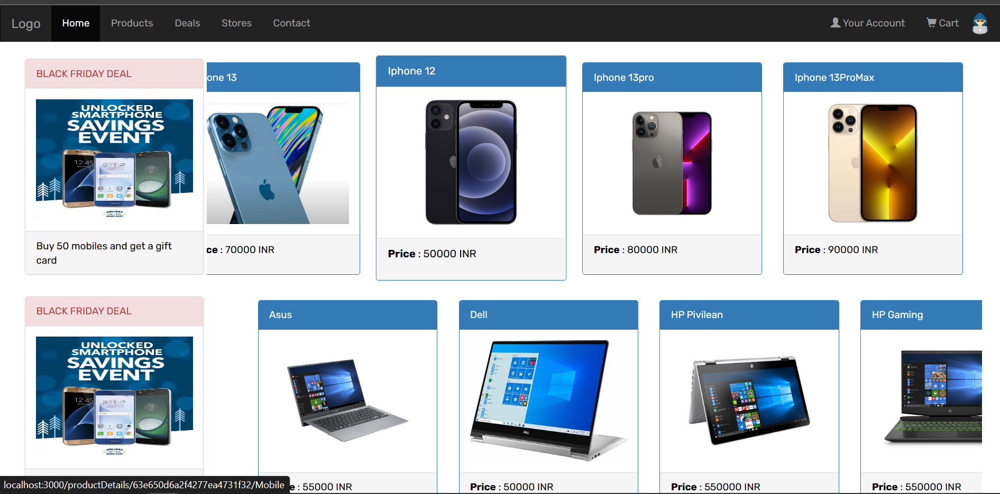
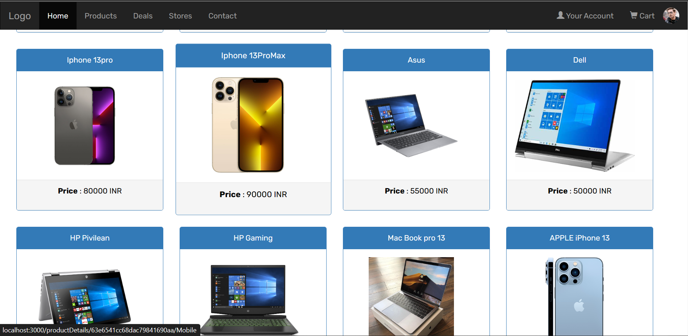
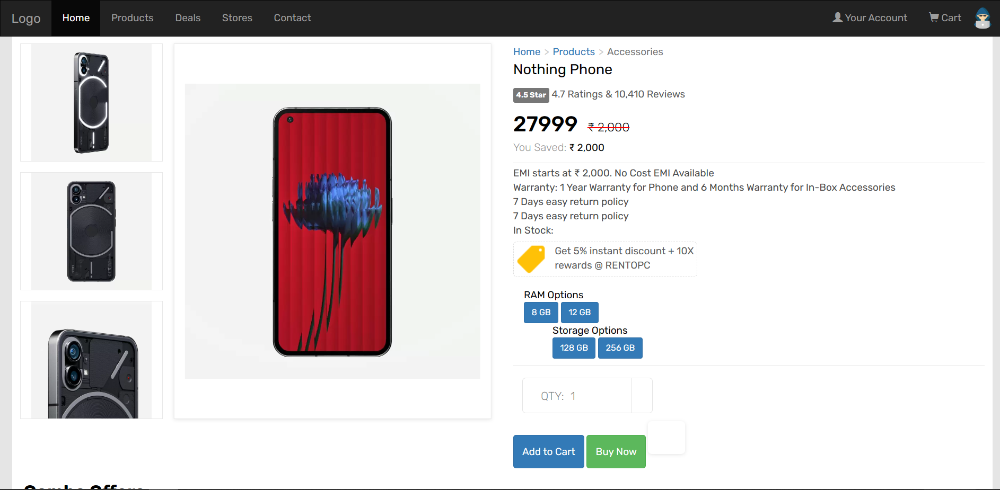
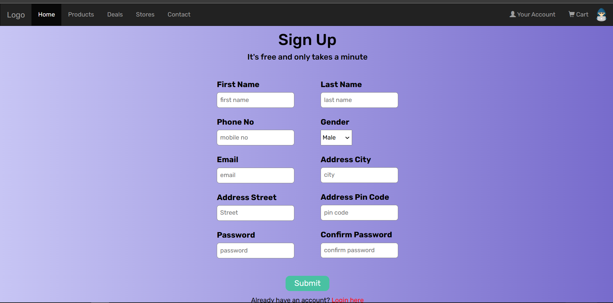
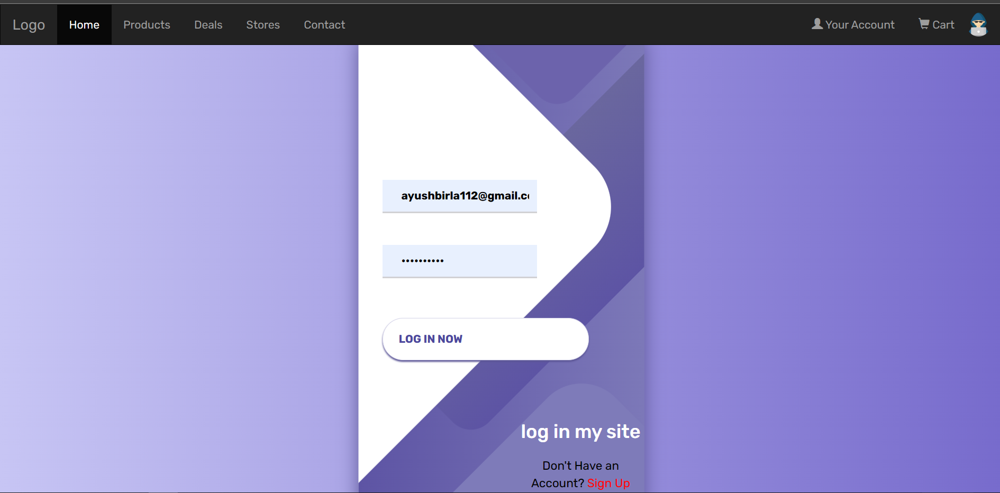
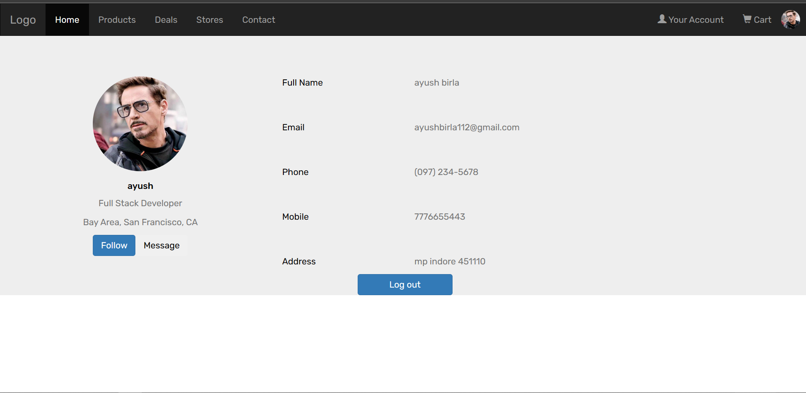
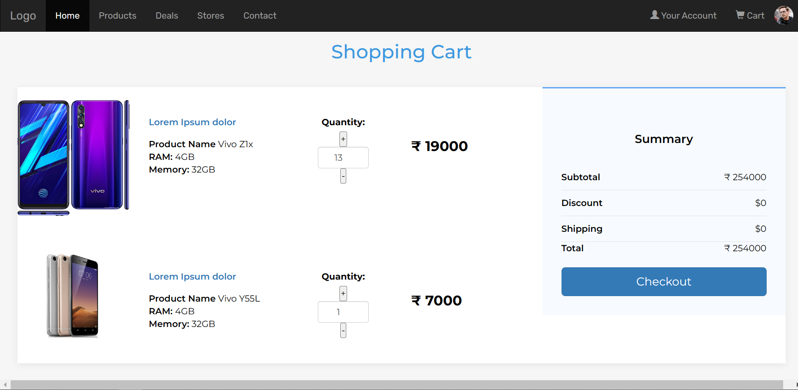
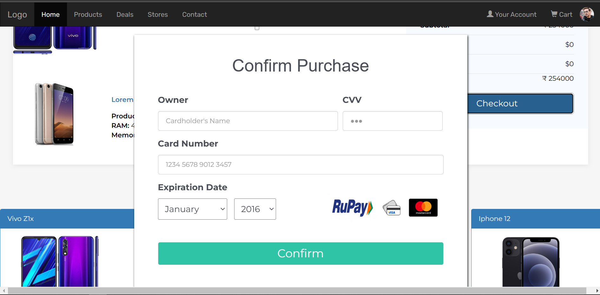
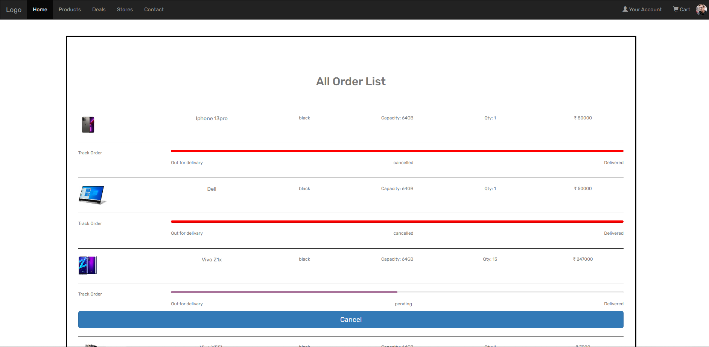

# Project - eCommerce Frontened

## Make sure to check Backend Repository :  

## Deploy Link :

## Overview
Ecommerce website is an online shopping site which is used to buy products online.
You can buy any product easily.
E-commerce website saves your time as well as provides good quality products at your doorstep.
Procedure to buy a product First create an account on the site and login.
Select any product or multiple products and add to cart and check your cart and click on checkout button to order those products. And click on the Order List button to check your order status or cancel the order.
This e-commerce site offers a wide variety of products and also provides some festive offers on the products.

## Installation and Setup
1. Clone the repository to your local machine.
2. Run npm install to install the dependencies.
3. Run npm start to start the app.

## Usage
1. Navigate to the Home page using the navbar if you have registerd otherwise need to registered first.
2. Fill out the form with a name, password, address, email, phone.no for sighUp.
3. Click the "SighUp" button to registered.
4. Navigate to login page so need to loging with email and password.
5. Aftar login navigate to home page and you authorized to chack your cart or order Details.
6. Click any product and add to cart.
7. Aftar adding move to cart and click checkout button and put cart detail and order tham.
8. Aftar ordering chack your order list.

## Technologies Used
1. MongoDB: a NoSQL database used for storing and retrieving data
2. Express.js: a web application framework for Node.js
3. React: a JavaScript library for building user interfaces
4. Node.js: a JavaScript runtime environment for running server-side code
5. Bootstrap: a CSS framework for building responsive web pages
6. AWS S3: a Amazon Simple Storage Service for storing user profile photo and product cover photos

## About

## Screenshots
The following screenshots provide a visual representation of the app:

###### Home Page

 
 
 

###### Product List Page

 
 
 

###### Product Details Page

 
 
 

###### SingUp page

 
 
 

###### Login Page

 
 
 

###### Your Profile Page

 
 
 

###### Cart Page

 
 
 

###### Payment Details page

 
 
 

###### Order list

 

## Credits
This project uses several open-source libraries and tools:

1. React
2. Node.js
3. Express.js
4. Bootstrap
5. AWS S3
